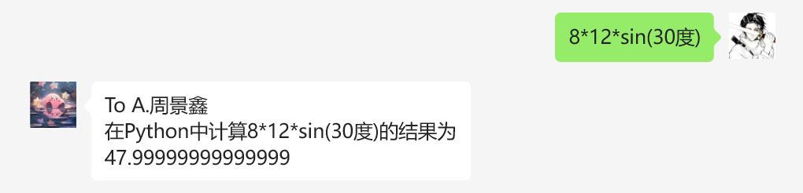
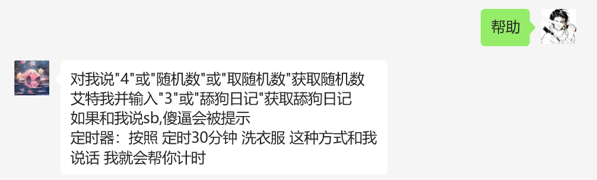
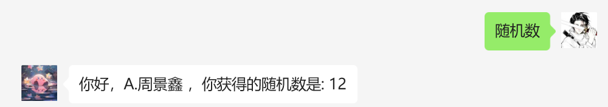
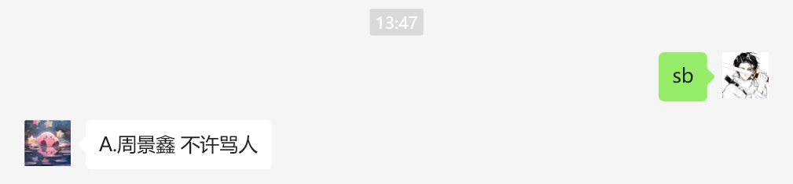
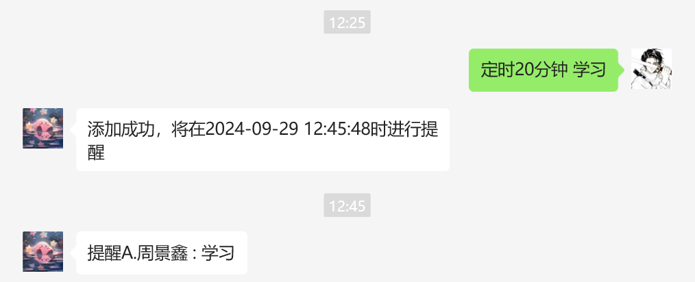

## 基于itchat的微信机器人

by 周景鑫：`zjxyyds0307`

1. 项目基于`itchat`库，定义了一个信息类，通过继承这个信息类并实现其抽象方法就可以实现自动回复消息等。

2. 项目总览

   ```
   │  main.py								主文件
   │  readme.md							帮助文档
   │
   ├─dirty_word_del						脏话警告模块
   │      __init__.py
   │
   ├─Info_class							信息类基类
   │      __init__.py
   │
   ├─itchat_msg_reply						自动回复模块(不需要编辑)
   │      __init__.py
   │
   ├─random_number							随机数模块
   │      __init__.py
   │
   └─Settings								设置参数模块
           __init__.py
   ```

3. 基类介绍

   ```python
   class TextInfo:
       @abc.abstractmethod
       def isReplyPerson(self, NickName: str) -> bool:
           """
           用于指定私聊中这个人是否要回复这类消息(以及帮助文档中是否要显示)
           :param NickName: 用户昵称
           :return: 真假值表示是否回复
           """
           pass
   
       @abc.abstractmethod
       def isReplyGroup(self, GroupName: str) -> bool:
           """
           用于指定群聊中这个群是否要回复这类消息(以及帮助文档中是否要显示)
           :param GroupName: 群聊名称
           :return: 真假值表示是否回复
           """
           pass
   
       @abc.abstractmethod
       def PersonReplyText(self, NickName: str, Message: str, user) -> str:
           """
           私聊是否回复 如果回复返回回复的内容 如果不回复返回None
           :param user: 传递msg中的user字段方便后续发消息
           :param NickName: 昵称
           :param Message: 消息
           :return: 回复的内容或者None
           """
           pass
   
       @abc.abstractmethod
       def GroupReplyText(self, isAt: bool, GroupName: str, NickName: str, Message: str, user) -> str:
           """
           群聊消息是否回复 如果回复返回回复的内容 如果不回复返回None
           :param user: 传递msg中的user字段方便后续发消息
           :param isAt: 是否被艾特
           :param GroupName: 群聊名称
           :param NickName: 用户昵称
           :param Message: 消息文本
           :return: 回复的内容或者None
           """
           pass
   
       @abc.abstractmethod
       def GroupHelp(self) -> str:
           """
           在群聊内显示的帮助文字
           :return: 帮助文字
           """
           pass
   
       @abc.abstractmethod
       def PersonHelp(self) -> str:
           """
           在私聊内显示的帮助文字
           :return: 帮助文字
           """
           pass
   ```

4. 快速开始

   快速开始以`RandomNumber `(随机数模块) 举例

   1. 继承基类并实现其抽象函数

      ```python
      class RandomNumber(TextInfo):
          def isReplyPerson(self, NickName: str) -> bool:
              pass
      
          def isReplyGroup(self, GroupName: str) -> bool:
              pass
      
          def PersonReplyText(self, NickName: str, Message: str, user) -> str:
              pass
      
          def GroupReplyText(self, isAt: bool, GroupName: str, NickName: str, Message: str, user) -> str:
              pass
      
          def GroupHelp(self) -> str:
              pass
      
          def PersonHelp(self) -> str:
              pass
      ```

   2. 编写`isReplyPerson`函数

      ```python
      def isReplyPerson(self, NickName: str):
          return True
      ```

      通过逻辑我们可知，对于任意昵称的用户都可以使用这个随机数功能，所以我们返回`True`

   3. 编写`isReplyGroup`函数

      ```python
      def isReplyGroup(self, GroupName: str):
          return True
      ```

      通过逻辑我们可知，对于任意群聊都可以使用这个随机数功能，所以我们返回`True`

   4. 编写`PersonReplyText`函数

      ```python
      def PersonReplyText(self, NickName: str, Message: str, user):
          for s in self.start_list:
              if Message.lower() == s:
                  return f'你好，{NickName}，你获得的随机数是: {random.randint(1, 100)}'
          return None
      ```

      这条语句需要有一条触发词，所以我们将触发词放在`self.start_list`中。

      ```python
      start_list = ['4', '随机数', '取随机数']
      ```

      通过本方法可以得知，私聊机器人说“4”，“随机数”，“取随机数”都会触发回复，否则返回None则为不回复。

   5. 编写`GroupReplyText`函数

      ```python
      def GroupReplyText(self, isAt: bool, GroupName: str, NickName: str, Message: str, user):
          if not isAt:
              return None
          for s in self.start_list:
              if Message.lower() == s:
                  return f'你好，{NickName}，你获得的随机数是: {random.randint(1, 100)}'
      ```

      通过理解逻辑我们得知，此条消息需要再群内机器人被艾特后并且输入触发词才进行触发。

   6. 编写`GroupHelp`与`PersonHelp`函数

      ```python
      def GroupHelp(self):
          word = '"' + '"或"'.join(self.start_list) + '"'
          return f'艾特我并输入{word}获取随机数'
      
      def PersonHelp(self):
          word = '"' + '"或"'.join(self.start_list) + '"'
          return f'对我说{word}获取随机数'
      ```

      这两条函数返回值为帮助文档中的值。

   7. 添加配置

      进入`main.py`，导入包并在`TextInfoList`中添加类的实例对象

      ```python
      from Settings import *
      from random_number import RandomNumber # 导入包
      from dirty_word_del import DirtyWordDel
      from itchat_msg_reply import run
      
      TextInfoList.append(RandomNumber()) # 添加类的实例对象
      TextInfoList.append(DirtyWordDel())
      
      if __name__ == '__main__':
          run()
      
      ```

      需要注意的是，向`TextInfoList`中加入的必须是类的实例对象。

      错误示范：

      ```python
      TextInfoList.append(RandomNumber) # 这样就错了 导入的是类 没有实例化
      ```

      正确示范：

      ```python
      TextInfoList.append(RandomNumber()) # 这样才对了 加了小括号给实例化
      ```

   8. 运行程序

      使用`python main.py`就可以了！！！

5. 已有的类

   1. `DefaultInfo`

      源码位于`Info_class/__init__.py` 

      主要作用为在用户输入的提示词等不与任何消息匹配时进行输出。

      ```python
      def PersonReplyText(self, NickName: str, Message: str) -> str:
          o = Message
          try:
              replaceList = [["（", '('], ['）', ')'], ['–', '-'], [' ', '']]
              for r in replaceList:
                  Message = Message.replace(r[0], r[1])
              Message = Message.replace('度', '*pi/180').replace('count', '')
              return f'To {NickName}\n在Python中计算{o}的结果为{eval(Message)}'
          except:
              pass
          return '你好 我是zjxbot 你说的我没有听懂 对我说help获取帮助'
      ```

      这部分主要进行了将用户输入转化为表达式进行计算，如计算不成功则输出`你好 我是zjxbot 你说的我没有听懂 对我说help获取帮助`

   2. `EmptyInfo`

      源码位于`Info_class/__init__.py`

      主要作用为在用户只进行艾特、无提示词时进行输出。

      ```python
      def GroupReplyText(self, isAt: bool, GroupName: str, NickName: str, Message: str) -> str:
          return '你好 我是zjxbot 有什么可以帮助你 对我说help获取帮助'
      ```

      这部分进行了回复用户的艾特并回复`你好 我是zjxbot 有什么可以帮助你 对我说help获取帮助`

6. 效果截图

   1. 未匹配时`DefaultInfo`

      

   2. 帮助

      

   3. 随机数

      

   4. 骂人提醒

      

   5. 定时器（源码没带）

      

